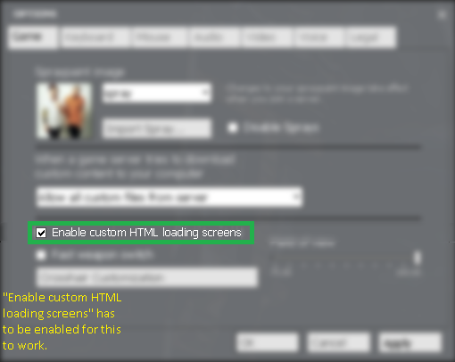
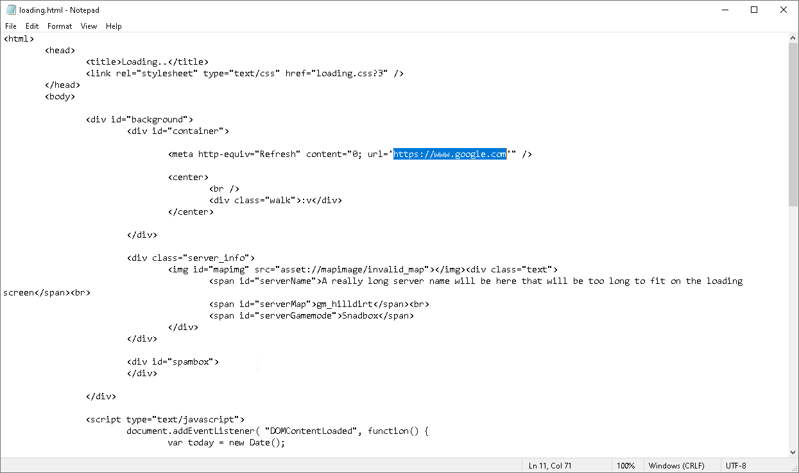

# gmod-loading-screen-as-website
this is a modification of the HTML loading screen in gmod that refreshes the page and redirects you to google.com

this is how it looks, might not be useable half the time because gmod freezes when loading some stuff (resources and whatnot)

make sure to have "custom HTML loading screens checked" (Settings > Game)

modify line 11 in "loading.html" to change the website, feel free to reupload but credit me if you do.

